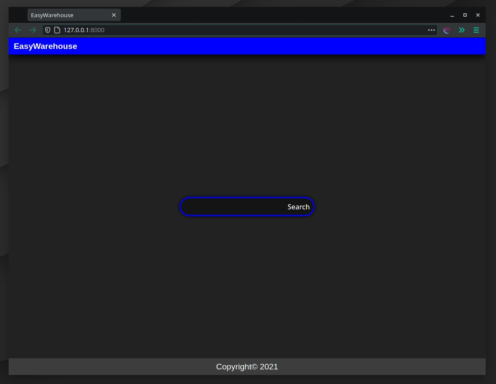

# easyWarehouse

Best warehouse management software. Keep in mind it is still in beta.

## Features

 - Easy-to-use WMS. Suited for small and medium warehouses
 - Free and open source
 - Pretty guest side for your clients
 - Build on Django framework
 - Independent analytics platform

## What it looks like

## Free

    Yes. You can use it without fees. No personal data is collected. Build-in
    analytics platform is hosted locally.

## Contributing

    Sure, read section below to get started. We accept pull requests.

## Development

    0. Dependencies are managed with poetry. You can install poetry with command:
        `python -m pip install poetry`
    
    1. To initialize virtualenv and install packages, run: `poetry install`
    
    2. All databases and their admin panels are defined in *docker-compose.py*.
        To run all of them type: `docker-compose up`. To run particular service,
        enter: `docker-compose up <service-name>`
    
    3. To start the server, run: `python easywarehouse/manage.py runserver`
    
    4. Before pushing your changes, format the code with black and isort:
        `make format`
